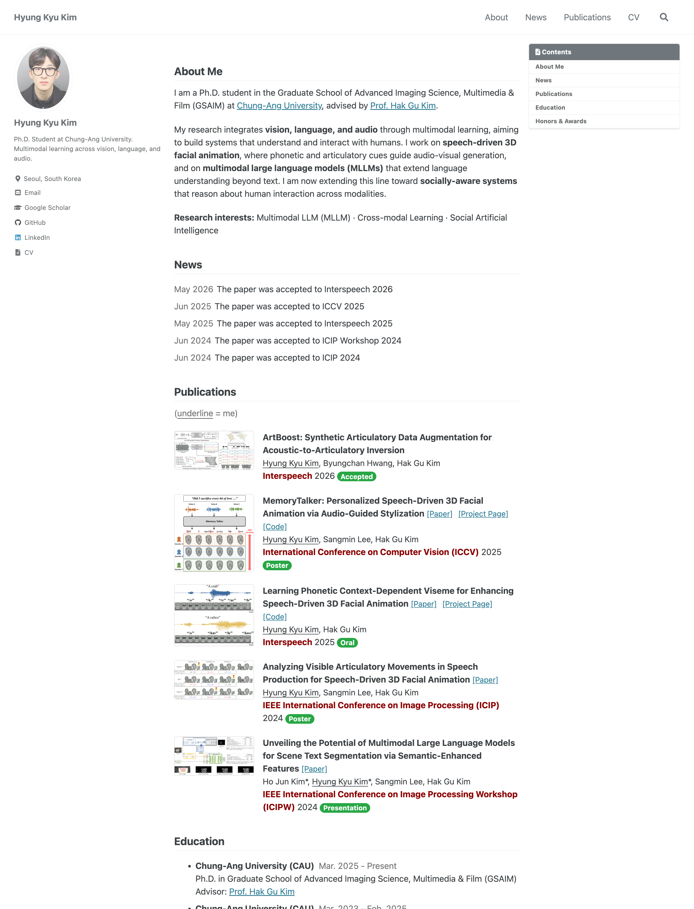

# Hyung Kyu Kim



Personal academic homepage of **Hyung Kyu Kim** — research interests, publications, and news.

🔗 **Live site:** https://kimhyungkyu-1208.github.io/HYUNG-KYU-KIM/

## About Me

I am a **Ph.D. student** in the Graduate School of Advanced Imaging Science, Multimedia & Film (GSAIM) at [Chung-Ang University](https://www.cau.ac.kr/index.do), advised by [Prof. Hak Gu Kim](https://hgkimcau.github.io). My research integrates **vision, language, and audio** through multimodal learning to build systems that understand and interact with humans.

## Research Interests

- Multimodal Large Language Models (MLLMs)
- Cross-modal Learning (Language · Vision · Audio)
- Social Artificial Intelligence (Social Understanding / Reasoning)
- Speech-Driven 3D Facial Animation

## Selected Publications

Full list: [Publications](https://kimhyungkyu-1208.github.io/HYUNG-KYU-KIM/#publications)

- **ArtBoost: Synthetic Articulatory Data Augmentation for Acoustic-to-Articulatory Inversion** — *Interspeech*, 2026
- **MemoryTalker: Personalized Speech-Driven 3D Facial Animation via Audio-Guided Stylization** — *ICCV*, 2025
- **Learning Phonetic Context-Dependent Viseme for Enhancing Speech-Driven 3D Facial Animation** — *Interspeech*, 2025 (Oral)

## Contact

- 📧 Email: [hyung1208@cau.ac.kr](mailto:hyung1208@cau.ac.kr)
- 💻 GitHub: [kimhyungkyu-1208](https://github.com/kimhyungkyu-1208)
- 🔗 LinkedIn: [rlagudrb1208](https://www.linkedin.com/in/rlagudrb1208/)
- 📄 [Curriculum Vitae](assets/pdf/CV26-HK_v03.pdf)

---

## Development

This site is built with [Jekyll](https://jekyllrb.com/) and the [Minimal Mistakes](https://github.com/mmistakes/minimal-mistakes) theme (via `remote_theme`), and deployed with GitHub Pages.

```bash
bundle install
bundle exec jekyll serve
# → http://127.0.0.1:4000/HYUNG-KYU-KIM/
```

Content lives in data files and collections:

- `_data/profile.yml` — bio, education, honors & awards
- `_publications/` — one Markdown file per paper
- `_news/` — one Markdown file per news item
- `_config.yml` — theme, author sidebar, and site settings
